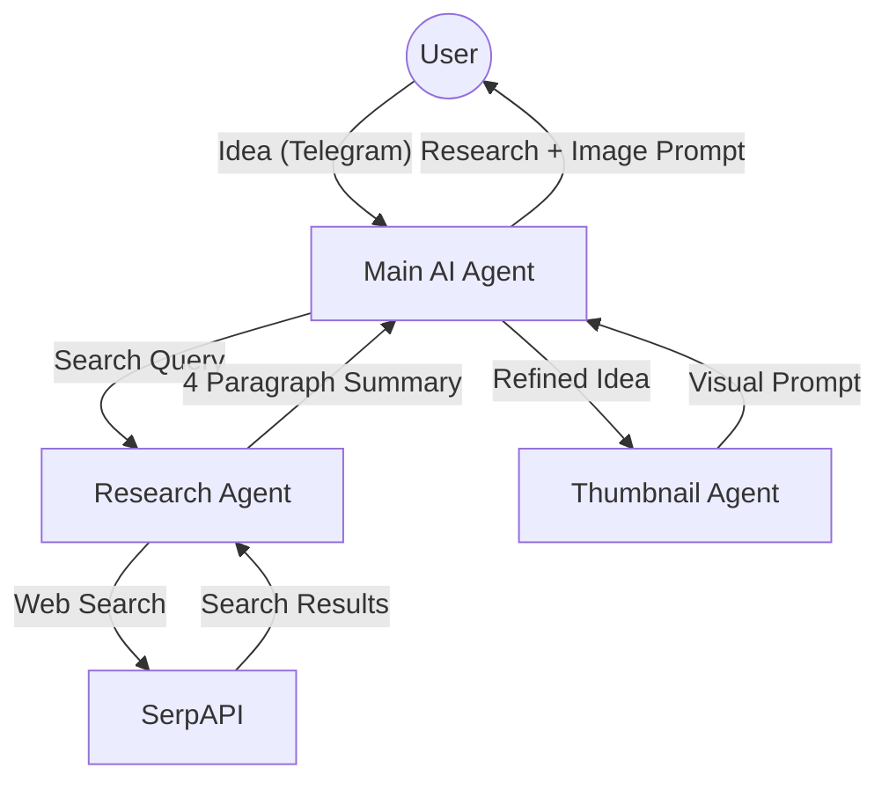

# 🚀 AI YouTube Production Agent

An automated YouTube pre-production system built with **n8n**, **Groq (Llama 3.3)**, and **SerpAPI**. This system transforms a simple idea into a researched topic and a high-quality thumbnail prompt, controlled entirely via **Telegram**.

## 🏗️ System Architecture



## 🛠️ Features

- **Automated Research**: Uses **SerpAPI** and **Llama 3.3 (Groq)** to conduct deep web searches on any topic.
- **Thumbnail Creation**: Dedicated **Thumbnail Agent** that generates precise, descriptive prompts for image generators (Midjourney, DALL-E, etc.).
- **Seamless Integration**: Fully orchestrated via **n8n** and accessible through a **Telegram** bot interface.
- **Secure by Design**: Credentials managed through n8n's secure credential system and local `.env` protection.

## 📂 Project Structure

- `Main AI AGENT.json`: The central orchestrator and Telegram interface.
- `RESEARCH AGENT.json`: Handles web search and information synthesis.
- `THUMBNAIL AGENT.json`: Generates high-impact visual prompts for YouTube thumbnails.
- `.env.example`: Template for required API keys.
- `.gitignore`: Prevents sensitive credentials from being leaked.

## 🚀 Setup Instructions

1.  **Import Workflows**: Import the three `.json` files into your **n8n** instance.
2.  **Configure Credentials**:
    - **Telegram API**: Create a bot via [@BotFather](https://t.me/botfather).
    - **Groq API**: Get your key from [Groq Console](https://console.groq.com/).
    - **SerpAPI**: Get your key from [SerpAPI](https://serpapi.com/).
3.  **Link Workflows**: Ensure the `Execute Workflow` nodes in the **Main AI AGENT** point to the correct internal IDs of your **Research** and **Thumbnail** workflow.
4.  **Local Environment**: Use the provided `.env.example` to manage your local keys safely.

## 🔑 Environment Variables

Copy `.env.example` to `.env` and fill in your keys:

```text
TELEGRAM_BOT_TOKEN=your_token
GROQ_API_KEY=your_key
SERP_API_KEY=your_key
```

---

_Created with ❤️ by your AI Agent._
